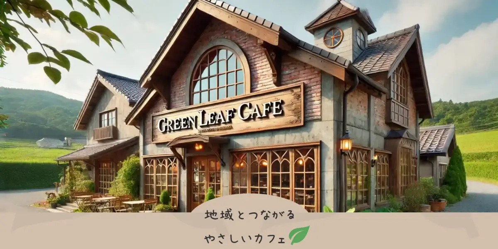

# 独学でスキルを磨き、Web制作の道へ
求職者支援訓練と独学を通じて、デザインとフロントエンド開発の技術を習得。 
現在は実用レベルのポートフォリオ制作に取り組んでいます。 
 
 
 
 

# 自主開発ロードマップ
 
 

## 目次
- [GBFHelper｜グラブル攻略](#gbfhelper)
- [fontsplit](#fontsplit)
- [GreenLeafCafe](#greenleafcafe)

 
 

## GBFHelper｜グラブル攻略

### 開発
2024年9月 ～
### 概要
グランブルーファンタジーの攻略サイトです。 
ユーザーをサポートする UI を搭載し、既存の攻略サイトと差別化しています。
### 目的
1. アップデートによって攻略情報が複雑になり、ユーザーが混乱しやすい状況を解決する。 
2. 初心者ユーザーが勘違いしないよう、最新情報を記載し、少しでもゲームを快適に進められることを目指す。
### 課題
1. 今のところ、データの表示に特化しすぎており、解説が少ない。（初心者ユーザーに不親切）
2. 対応しきれていないコンテンツがある。
3. まだまだ機能が少ない
### 採用技術
- Astro：静的サイトで対応可能なので、表示速度を重視
- React：UI の操作性向上、ユーザー操作による表示データの切替
- TypeScript：コードのメンテナンス性を維持
### リンク
- [リポジトリはこちら](https://github.com/stwch/GBFHelper#readme)  
- [サイトはこちら](https://gbf-helper.com)

 
 
 
 

## fontsplit

### 開発
2025年1月 ～
### 概要
Webフォントをセルフホスティングに最適化する npmパッケージです。
フォントファイルを分割し、最適な fontface を生成します。
### 目的
1. Webフォントの選択を自由にする。
2. フォントをセルフホスティングすることで、外部サービスへの依存を無くす。
3. フォントの読み込みによるパフォーマンス低下を解決する。
### 課題
1. 日本語と英語にしか対応していない。
2. コマンドラインで使うと可読性が低い。
3. コマンドライン以外で使うならコードを書く必要があり、ひと手間かかる。
### 採用技術
- Node.js：ファイルを読み込み、コマンドラインで実行するため
- TypeScript：コードのメンテナンス性を維持
- JavaScript：すぐに実行できるサンプルコードの作成
### リンク
- [リポジトリはこちら](https://github.com/stwch/fontsplit#readme)  
- [npm はこちら](https://www.npmjs.com/package/fontsplit)

 
 
 
 

## GreenLeafCafe（改修中）

### 開発
2024年12月 ～
### 概要
架空のカフェのホームページです。 
AI をフル活用し、より、リアルなホームページへリニューアルします。
### 要望（AI）
1. 地元の住民や観光客に向けて、カフェの魅力を発信するためのウェブサイトを制作してほしい。
2. オンラインでの予約や問い合わせができる仕組みを導入したい。
3. 写真素材はこちらで提供しますが、その他の素材（アイコンやイラスト）は相談の上、必要であれば用意してほしい。
### 実装機能
1. ブログ（カフェの魅力の発信）
2. オンライン予約システム（予約、キャンセル、自動送信メール）
3. お問い合わせ（入力フォーム）
### 採用技術
- Next.js：API で予約システム、ブログを動的に取得する
- WordPress：予約システムとブログを一括管理し、クライアントの負担を軽減
- TypeScript：コードのメンテナンス性を維持
### 開発進行状況
- 静的な実装完了
- 予約システムの動作確認済み

今後の予定：ブログ機能の実装
### リンク
- [リポジトリはこちら](https://github.com/stwch/green-leaf-cafe#readme)
