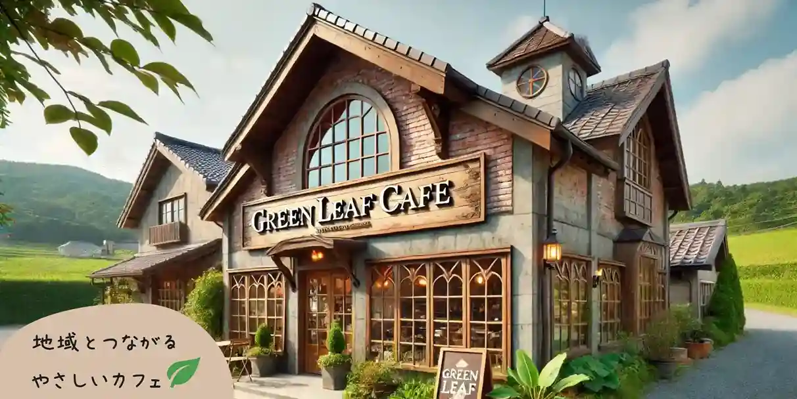

# 自己紹介
日々の生活を便利にしてくれるWebサイトが大好きなWeb制作者です。 
4年間の制作経験や、サービス業の経験を活かして、ユーザーフレンドリーなWebサイトを制作します。 

※ユーザーフレンドリーとは、簡単に言うと、「便利・快適」ということです。 
 
 
 

## 経験を活かして貢献できること
- 静的サイトのコーディング（ LP、コーポレートサイト等 ）
- CMS によるブログ構築（ WordPress、microCMS 等 ）
- WordPress カスタムテーマ構築（ 世界に1つだけのあなた専用のブログ ）
- UIデザイン（ 使いやすさを重視 ）
- Webデザイン（ 美しく綺麗なレイアウトで印象付ける ） 
 
 
 

## 使用している主な技術
- 基本 
　　　

- フレームワーク 
　　　

- ツール 
　 
 
 
 

## 代表的な制作物
 

### GreenLeafCafe

- クライアント 
ChatGPT

- 実装機能 
イベント予約、ブログ
  
- 技術スタック 
　　　　

#### 制作のポイント
AI からの制作依頼です。 
架空の店舗情報を学習した AI にヒアリングを行いました。 
かなりハッキリと意思表示をしてくるので進めやすく感じましたが、やり取りがある分リアルで楽しかったです。 
WordPress の API とNext.js を連携させ、予約システム、ブログの実装に挑戦しています。 
現在、制作中です。 
 
リポジトリ→ https://github.com/stwch/green-leaf-cafe  
 
 

### fontsplit

- 機能 
フォントファイルの分割と、それらを使用するための font-face を生成します。 
これにより、ブラウザが必要な文字を含む小さいファイルだけ読み込めるようになります。

- 技術スタック 
　

#### 制作のポイント
サブセット化ではカバーできない動的な部分（ フォームの入力等 ）に Webフォントを使用するために開発しました。 
GoogleFonts の仕組みを参考にしています。 
これを開発したことで、フォントファイルがあれば分割できるようになったので、フォントの選択がしやすくなり、制作が快適になりました。 
 
npm → https://www.npmjs.com/package/fontsplit  
リポジトリ→ https://github.com/stwch/fontsplit  
 
 

### GBFHelper｜グラブル攻略サイト

- クライアント 
自分

- 実装機能 
UIデザイン

- 技術スタック 
　　　

#### 制作のポイント
グランブルーファンタジーというソシャゲの攻略サイトです。 
実際に役立つサイトを制作したいと思い初制作し、現在も稼働およびメンテナンスしています。 
スムーズにわかりやすくデータを表示することを重視してデザインしました。 
 
サイト→ https://gbf-helper.com  
リポジトリ→ https://github.com/stwch/GBFHelper  
